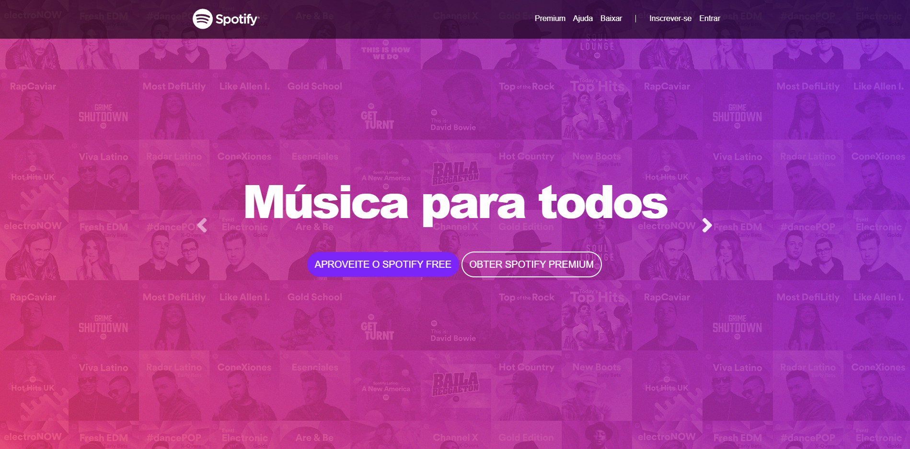

# 🎵 Projeto Spotify

Projeto de desenvolvimento web criado durante meus estudos de HTML5, CSS3 e Bootstrap, com o objetivo de reproduzir a estrutura visual de uma plataforma de streaming de música.

## 🖥️ Preview

## 🎯 Principais funcionalidades

* Menu de navegação para acesso às diferentes áreas da página
* Botões de navegação para Premium, Ajuda, Baixar e Inscrever-se
* Utilização de imagens para composição visual da interface
* Layout responsivo, adaptando-se a diferentes tamanhos de tela
* Efeito Parallax durante a rolagem da página
* Efeito de carrossel para apresentação dos elementos visuais
* Interface inspirada na identidade visual do Spotify
* Estrutura desenvolvida com HTML5, CSS3 e Bootstrap

## 📌 Sobre o projeto

O projeto consiste na criação de uma interface web inspirada no Spotify, utilizando recursos de desenvolvimento front-end para estruturar e estilizar diferentes elementos da página.

O desenvolvimento foi utilizado como prática para compreender melhor a construção de interfaces responsivas e a utilização de frameworks CSS.

## 🛠️ Tecnologias utilizadas

* HTML5
* CSS3
* Bootstrap

## 📚 Conhecimentos praticados

* Estruturação de páginas com HTML5
* Estilização com CSS3
* Utilização do Bootstrap
* Criação de layouts responsivos
* Organização de elementos de interface
* Desenvolvimento front-end

## 🎯 Objetivo

Praticar os fundamentos do desenvolvimento front-end e aprender a utilizar o Bootstrap na construção de interfaces web.

## 🌐 Demonstração

Caso o projeto esteja publicado no GitHub Pages, adicione aqui o link:

**[Acessar o projeto](https://jonatasdassantos.github.io/projeto-inicial-spotify/)**

## 👨‍💻 Autor

**Jonatas da Silva Santos**

🎓 Graduado em Análise e Desenvolvimento de Sistemas

💻 GitHub: https://github.com/jonatasdassantos

💼 LinkedIn: https://www.linkedin.com/in/jonatas-da-silva-santos-33653b224/
