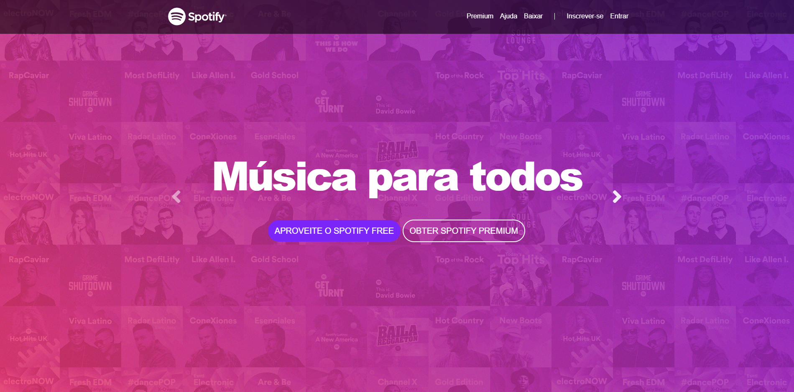

# 🎵 Projeto Spotify

Interface web inspirada na página do **Spotify**, desenvolvida para praticar **HTML5, CSS3 e Bootstrap**.

O projeto apresenta uma página responsiva com navegação, carousel, botões de ação, seções informativas, imagens, efeitos visuais e rodapé organizado em diferentes áreas.

## 📸 Preview



## 🚀 Funcionalidades

* 🎵 Interface inspirada no Spotify
* 📱 Layout responsivo
* 🧭 Barra de navegação responsiva
* 📑 Menu de navegação com Bootstrap
* 🎞️ Carousel de conteúdo
* 🎨 Botões personalizados
* 🖼️ Seções com imagens e conteúdo informativo
* 🔄 Efeito de rotação nas imagens dos smartphones
* 📐 Layout estruturado com sistema de grid do Bootstrap
* 📱 Adaptação da tipografia para diferentes tamanhos de tela
* 🔗 Seção de links e redes sociais no rodapé
* 🎨 Background com imagens, textura e gradiente
* ✨ Efeitos de hover nos elementos de navegação e botões

## 🧭 Estrutura da página

O projeto está dividido em diferentes áreas:

### Header

Contém a barra de navegação principal com:

* Logo do Spotify
* Premium
* Ajuda
* Baixar
* Inscrever-se
* Entrar

A navegação utiliza componentes do Bootstrap para permitir o comportamento responsivo em telas menores.

### 🏠 Seção inicial

A seção principal apresenta um carousel com diferentes mensagens e botões de ação.

Entre os conteúdos apresentados estão:

* "Música para todos"
* "As melhores rádios"
* Botão Spotify Free
* Botão Spotify Premium
* Botão para ouvir agora

O carousel utiliza o componente de carousel do Bootstrap.

### 🎵 Seção de serviços

Apresenta informações sobre os recursos relacionados ao Spotify:

* Músicas
* Playlists
* Novos lançamentos

Também utiliza imagens organizadas através do sistema de grid do Bootstrap.

### 📱 Seção de recursos

Apresenta conteúdos relacionados a:

* Buscar
* Navegar
* Descobrir

Além disso, contém imagens de smartphones posicionadas com um efeito de rotação utilizando CSS.

```css
.rotacionar {
    transform: rotate(30deg);
}
```

### 🦶 Rodapé

O footer contém:

* Logo
* Informações sobre a empresa
* Comunidades
* Links úteis
* Ícones de redes sociais

Os links também possuem efeitos de `hover` desenvolvidos com CSS.

## 📱 Responsividade

O projeto utiliza **Media Queries** para adaptar a interface a diferentes tamanhos de tela.

Foram definidos comportamentos específicos para:

* 📱 Smartphones
* 📱 Tablets
* 💻 Notebooks
* 🖥️ Desktops
* 🖥️ Monitores maiores

A principal adaptação ocorre na tipografia e espaçamento dos botões.

Exemplo:

```css
@media (max-width: 575.98px) {
    h1 {
        font-size: 3em;
    }

    .btn-custom {
        margin: 10px 15px;
    }
}
```

## 🎨 Recursos de CSS utilizados

O projeto utiliza diversos recursos de CSS, incluindo:

* Background com múltiplas camadas
* Gradiente linear
* Background fixo
* Transparência com `rgba`
* Pseudoestado `:hover`
* Transições
* Transformações
* Rotação de elementos
* Media Queries
* Tipografia personalizada
* Bordas arredondadas
* Organização de espaçamentos
* Cores e estilos personalizados

Um dos backgrounds combina imagem, textura e gradiente:

```css
background: url(../imagens/capa.png),
            url(../imagens/ruido.png),
            linear-gradient(50deg,#ff4169,#7c26f8);
```

## 🧩 Bootstrap

O projeto utiliza **Bootstrap 4.1.3** para estruturar e facilitar a responsividade da interface.

Entre os recursos utilizados estão:

* `container`
* `row`
* `col-md-*`
* `navbar`
* `navbar-expand-sm`
* `navbar-toggler`
* `carousel`
* `carousel-item`
* `btn`
* `img-fluid`
* classes utilitárias de alinhamento e espaçamento

## ⭐ Bibliotecas utilizadas

### Bootstrap

Utilizado para estrutura de layout, responsividade, navegação e carousel.

### Font Awesome

Utilizado para os ícones presentes nos botões e controles do carousel.

### jQuery

Utilizado como dependência do Bootstrap para funcionamento de componentes interativos.

### Popper.js

Utilizado como dependência do Bootstrap 4.

## 🛠️ Tecnologias utilizadas

* HTML5
* CSS3
* Bootstrap 4
* JavaScript
* jQuery
* Popper.js
* Font Awesome

## 📚 Conceitos praticados

Este projeto permitiu praticar:

* Estruturação de páginas HTML
* HTML semântico
* Organização de conteúdo com `section`, `header` e `footer`
* Classes e IDs
* Links e navegação
* Incorporação de bibliotecas externas
* Sistema de grid
* Responsividade
* Media Queries
* Manipulação visual com CSS
* Transições
* Pseudoestado `:hover`
* Transformações CSS
* Backgrounds múltiplos
* Gradientes
* Organização de componentes
* Utilização de frameworks CSS

## 🌐 Demonstração

O projeto possui uma versão publicada no GitHub Pages.

🔗 [Acessar o projeto](https://jonatasdassantos.github.io/projeto-inicial-spotify/)

## 💻 Código-fonte

🔗 [Ver código no GitHub](https://github.com/jonatasdassantos/projeto-inicial-spotify)

## 🎯 Objetivo do projeto

O projeto foi desenvolvido com o objetivo de praticar a criação de **interfaces web responsivas**, utilizando HTML5, CSS3 e Bootstrap.

A aplicação demonstra conhecimentos em estruturação de páginas, organização de layouts, responsividade, utilização de componentes prontos e personalização visual através de CSS.

## 👨‍💻 Autor

**Jonatas Santos**

📍 Salvador - BA

🔗 [LinkedIn](https://www.linkedin.com/in/jonatas-da-silva-santos-33653b224/)

🔗 [GitHub](https://github.com/jonatasdassantos)
